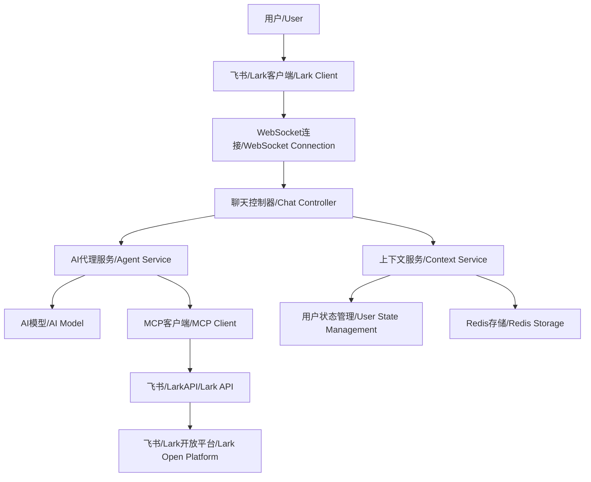

# 飞书/Lark MCP 智能助手机器人 Demo / Lark MCP Intelligent Assistant Bot Demo

[快速上手教程](https://open.feishu.cn/document/uAjLw4CM/ukTMukTMukTM/mcp_integration/develop-mcp-intelligent-assistant-bot)
[Quick Start](https://open.feishu.cn/document/uAjLw4CM/ukTMukTMukTM/mcp_integration/develop-mcp-intelligent-assistant-bot)

## 项目简介 / Project Overview

这是一个基于飞书/Lark 开放平台和 AI 模型的智能助手机器人 Demo 项目，通过集成 MCP(Model Context Protocol)协议，为用户提供智能对话和工具调用能力。

This is an intelligent assistant bot demo project based on Lark Open Platform and AI models, integrating MCP (Model Context Protocol) to provide users with intelligent conversation and tool calling capabilities.

⚠️ 注意：Demo 仅用于学习和功能演示，未考虑存储、部署、安全、日志等，请勿直接用于生产环境！若在生产环境使用，请自行承担风险！

### 主要特性 / Key Features

- **智能授权管理**: 用户可以在无需授权的情况下使用基础 AI 对话功能，仅在需要使用飞书 MCP 工具时通过 `/login` 命令进行授权。
- **Smart Authorization Management**: Users can use basic AI chat features without authorization, and only need to authorize via `/login` command when they want to use Lark MCP tools.
- **灵活的工具集成**: 支持多种 MCP 工具，包括多维表格、文档创建等飞书能力。
- **Flexible Tool Integration**: Supports various MCP tools including Bitable, document creation, and other Lark capabilities.
- **流式响应**: 实时流式更新 AI 响应，提供更好的用户体验。
- **Streaming Response**: Real-time streaming updates for AI responses, providing better user experience.

## 项目架构 / Project Architecture

```
src/
├── app.ts                 # 应用入口 / Application entry
├── config/
│   └── index.ts          # 配置管理 / Configuration management
├── controller/
│   └── chat.ts           # 聊天控制器 / Chat controller
├── provider/             # 提供者抽象层 / Provider abstraction layer
│   ├── lark.ts           # 飞书/Lark平台实现 / Lark platform implementation
│   └── type.ts           # 类型定义 / Type definitions
├── service/              # 核心服务层 / Core service layer
│   ├── agent.ts          # AI代理服务 / AI agent service
│   ├── context.ts        # 上下文管理 / Context management
│   ├── lark.ts           # 飞书/LarkAPI服务 / Lark API service
│   ├── mcp.ts            # MCP客户端服务 / MCP client service
│   └── redis.ts          # Redis存储服务 / Redis storage service
├── util/                 # 工具函数 / Utility functions
│   ├── index.ts          # 通用工具 / Common utilities
│   └── message.ts        # 消息处理 / Message processing
└── prompt/
    └── index.ts          # 系统提示词 / System prompts
```

### 架构说明 / Architecture Description



## 安装和配置 / Installation and Configuration

### 环境要求 / Prerequisites

- Node.js >= 20.0.0
- npm >= 8.0.0 或 yarn >= 1.22.0
- 飞书/Lark 开放平台应用 / Lark Open Platform Application
- AI 模型 API 访问权限 / AI Model API Access
- Redis 服务器 (用于存储用户认证令牌) / Redis Server (for storing user auth tokens)

### 1. 克隆项目 / Clone Project

```bash
git clone https://github.com/larksuite/lark-samples
cd mcp_larkbot_demo/nodejs
```

### 2. 安装依赖 / Install Dependencies

```bash
npm install
```

### 3. 环境配置 / Environment Configuration

创建 `.env` 文件并配置以下环境变量 / Create `.env` file and configure the following environment variables:

```env
# 飞书/Lark应用配置 / Lark Application Configuration
APP_ID=your_app_id
APP_SECRET=your_app_secret
LARK_DOMAIN=https://open.feishu.cn # 对于Lark用户通常为 https://open.larksuite.com For Lark users please use https://open.larksuite.com

# AI模型配置 / AI Model Configuration
OPENAI_BASE_URL=https://api.openai.com/v1
OPENAI_MODEL=gpt-4o
OPENAI_API_KEY=your_api_key

# 服务器配置 / Server Configuration
PORT=3000

# Redis配置 / Redis Configuration
# 格式 / Format: redis://[:password@]host[:port][/db]
# 示例 / Examples:
#   本地无密码 / Local without password: redis://localhost:6379
#   带密码 / With password: redis://:mypassword@localhost:6379/0
#   远程 / Remote: redis://:password@redis.example.com:6379/0
REDIS_URL=redis://localhost:6379
```

### 4. 飞书/Lark 应用配置 / Feishu/Lark Application Configuration

1. **创建应用 / Create an app**
   - 前往[飞书开发者后台](https://open.feishu.cn/app) 或者 [Lark 开发者后台](https://open.larksuite.com/app) 创建一个新的自建应用
   - Create a new built-in app in the [Feishu Developer Console](https://open.feishu.cn/app) or [Lark Developer](https://open.larksuite.com/app)
2. **机器人配置 / Bot Configuration**
   - 启用机器人功能 / Enable bot functionality

3. **权限配置 / Permission Configuration**

   - 添加必要的 API 权限 / Add necessary API permissions
     ```json
     {
       "scopes": {
         "tenant": [
           "im:message:send_as_bot",
           "im:message:readonly",
           "contact:user.id:readonly",
           "im:message.group_at_msg:readonly",
           "im:message.p2p_msg:readonly"
         ],
         "user": [
           "im:chat:read",
           "im:chat.members:read",
           "im:message:readonly",
           "wiki:wiki:readonly",
           "docx:document:readonly",
           "docx:document:create",
           "search:docs:read",
           "docs:document:import",
           "docs:document.media:upload",
           "docs:permission.member:create",
           "base:app:create",
           "base:table:create",
           "base:table:read",
           "base:field:read",
           "base:record:retrieve",
           "base:record:create",
           "base:record:update",
           "contact:user.id:readonly"
         ]
       }
     }
     ```

   - 配置 OAuth 重定向 URL: `http://localhost:3000/callback`

4. **事件订阅 / Event Subscription**

   - 在订阅事件前请先启动服务 / Before subscribing to events, please start the service first.
   - **选择连接模式 / Choose Connection Mode**:
     - **长连接 (推荐) / Persistent Connection (Recommended)**: 飞书用户推荐使用此模式。/ Recommended for Feishu users.
     - **Webhook**: Lark 用户或无法使用长连接的环境请选择此模式。/ For Lark users or environments that do not support persistent connections.
       - **配置 Webhook 地址 / Configure Webhook URL**:
         - 由于本地服务无法被 Lark 平台直接访问，您需要使用内网穿透工具（如 [ngrok](https://ngrok.com/download)）为您的本地服务创建一个公网可访问的地址。
         - Since your local service cannot be accessed directly by the Lark platform, you need to use a NAT traversal tool (e.g., [ngrok](https://ngrok.com/download)) to create a publicly accessible URL for your local service.
         - 在开发者后台的“事件订阅”页面，将请求地址配置为 `http://<your_public_domain>/webhook/event`。
         - In the "Event Subscription" page of the developer console, configure the request URL to `http://<your_public_domain>/webhook/event`.
   - **添加订阅事件 / Add Event Subscriptions**:
     - 订阅机器人需要的事件，例如 `im.message.receive_v1`。
     - Subscribe to the events required by the bot, such as `im.message.receive_v1`.

5. **发布应用 / Publish the app**

## 使用方法 / Usage

### 启动服务 / Start Service

- **长连接模式 (推荐) / Persistent Connection Mode (Recommended)**

  ```bash
  npm run dev
  ```

- **Webhook 模式 / Webhook Mode**

  如果您的 Lark 环境不支持长连接，或者您希望使用 Webhook 模式，请使用以下命令启动服务：
  If your Lark environment does not support persistent connections, or you want to use Webhook mode, please use the following command to start the service:

  ```bash
  npm run dev:webhook
  ```

### 自定义工具 / Customizing Tools

如果您需要自定义启用的工具集，可以直接修改 `src/service/mcp.ts` 文件。在该文件中，您可以找到被注释掉的工具配置代码，取消注释并根据您的需求进行修改即可。

If you need to customize the enabled toolset, you can directly modify the `src/service/mcp.ts` file. In this file, you will find commented-out tool configuration code. Uncomment it and modify it according to your needs.

[Learn More](https://open.feishu.cn/document/uAjLw4CM/ukTMukTMukTM/mcp_integration/advanced-configuration#74738783)

通过修改 `-t` 参数后的字符串，您可以指定加载不同的工具。

By modifying the string after the `-t` parameter, you can specify different tools to load.

### 与机器人互动 / Interacting with the Bot

启动服务后，您可以在飞书/Lark 中找到您的机器人并开始对话。
After starting the service, you can find your bot in Feishu/Lark and start a conversation.

#### 基础对话（无需授权）/ Basic Conversation (No Authorization Required)

您可以直接向机器人发送消息进行 AI 对话，无需授权：
You can directly send messages to the bot for AI conversations without authorization:

> 你好，请介绍一下你自己
> Hello, please introduce yourself

> 帮我写一个 Python 快速排序的代码
> Help me write a Python quick sort code

#### 使用 MCP 工具（需要授权）/ Using MCP Tools (Authorization Required)

如果您需要使用飞书 MCP 工具（如创建多维表格、文档等），需要先发送 `/login` 命令进行授权：
If you need to use Lark MCP tools (e.g., creating Bitables, documents), you need to send `/login` command first:

> /login

授权成功后，您可以使用 MCP 工具：
After successful authorization, you can use MCP tools:

> 帮我创建一个名为"项目任务"的多维表格，包含"任务名称"、"负责人"和"截止日期"这几列。
> Help me create a Bitable named "Project Tasks" with the columns "Task Name", "Assignee", and "Due Date".

机器人将会调用工具为您创建表格。
The bot will then call the appropriate tool to create the table for you.

### 用户交互流程 / User Interaction Flow

1. **添加机器人**: 在飞书/Lark 中添加你的机器人应用 / **Add the Bot**: Add your bot application in Feishu/Lark.
2. **发送消息**: 向机器人发送任意消息，即可与 AI 助手进行基础对话 / **Send a Message**: Send any message to the bot and start basic conversations with the AI assistant.
3. **授权登录（可选）**: 如需使用飞书 MCP 工具（如创建多维表格、文档等），发送 `/login` 命令，然后点击机器人发送的登录链接完成 OAuth 授权 / **Authorize via OAuth (Optional)**: To use Lark MCP tools (e.g., creating Bitables, documents), send `/login` command and click the login link to complete OAuth authorization.
4. **使用完整功能**: 登录成功后即可使用所有 MCP 工具功能 / **Use Full Features**: After successful login, you can use all MCP tool features.

### 特殊命令 / Special Commands

- `/login` - 触发授权登录流程，授权后可使用飞书 MCP 工具 / Trigger authorization login process to use Lark MCP tools
- `/clear` - 清除当前用户的对话上下文 / Clear the current user's conversation context

## 核心组件说明 / Core Components

### 聊天控制器 (ChatController)

负责协调多个聊天提供者，处理消息路由和用户认证流程。
Responsible for coordinating multiple chat providers, handling message routing and user authentication flow.

### AI 代理服务 (AgentService)

管理 AI 模型的对话生成，处理工具调用和流式响应更新。
Manages AI model conversation generation, handles tool calls and streaming response updates.

### 上下文服务 (ContextService)

维护用户的对话历史、认证状态（通过 Redis 持久化）和 MCP 客户端连接。
Maintains user conversation history, authentication state (persisted via Redis), and MCP client connections.

### 飞书/Lark 服务 (LarkService)

封装飞书/Lark 开放平台 API 调用，提供消息发送、用户信息获取等功能。
Encapsulates Lark Open Platform API calls, provides message sending, user info retrieval, etc.

### MCP 客户端服务 (MCPClientService)

创建和管理 MCP 客户端连接，提供工具调用功能。
Creates and manages MCP client connections, provides tool calling functionality.

### Redis 服务 (RedisService)

管理用户认证令牌的持久化存储，支持自动过期和 TTL 管理。
Manages persistent storage of user authentication tokens with automatic expiration and TTL management.

## 故障排除 / Troubleshooting

### 常见问题 / Common Issues

**Q: 机器人无法响应消息 / The bot does not respond to messages**
A: 检查服务的 WebSocket 连接状态，并确保您已在开发者后台正确订阅了 `im.message.receive_v1` 等事件。 / Check the WebSocket connection status of your service and ensure you have correctly subscribed to events like `im.message.receive_v1` in the developer console.

**Q: OAuth 授权失败 / OAuth authorization fails**
A: 确认您的 `.env` 文件中的 `APP_ID` 和 `APP_SECRET` 配置正确，并且开发者后台配置的重定向 URL (`http://localhost:3000/callback`) 与代码一致。 / Verify that `APP_ID` and `APP_SECRET` in your `.env` file are correct, and that the redirect URL configured in the developer console (`http://localhost:3000/callback`) matches the code.

**Q: AI 响应速度慢 / AI responses are slow**
A: 检查您的服务器与 AI 模型 API (`OPENAI_BASE_URL`) 之间的网络连接。如果是网络问题，请考虑更换服务器节点或使用代理。 / Check the network connection between your server and the AI model API (`OPENAI_BASE_URL`). If it's a network issue, consider changing your server location or using a proxy.

**Q: 工具调用失败 / Tool calls fail**
A: 确认 MCP 客户端连接正常，并检查机器人的 API 权限是否包含了工具所需的所有权限。 / Ensure the MCP client is connected correctly and check if the bot's API permissions include all scopes required by the tools.

**Q: Redis 连接失败 / Redis connection fails**
A: 确认 Redis 服务正在运行，并检查 `.env` 文件中的 `REDIS_URL` 配置是否正确。如果使用带密码的 Redis，请确保 URL 格式正确 (如 `redis://:password@host:port`)。 / Ensure Redis service is running and check if `REDIS_URL` in `.env` file is configured correctly. If using Redis with password, make sure the URL format is correct (e.g., `redis://:password@host:port`).
